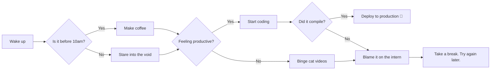

# Welcome to the Markdown Style Showcase

## It's Dangerous to Go Alone — Take This H2

This paragraph is here to test how your markdown text looks in a typical block of content, from *just a little dramatic* to **screaming**, or even ***screaming, dramatically***. We additionally highlight characters like this `*`. Proper emphasis <mark>is super important</mark> when evaluating markdown styling. You can find the Google Markdown styling guide [here](https://google.github.io/styleguide/docguide/style.html). 

---

## Quote of the Day

> "Markdown: because sometimes, writing HTML feels like bringing a tank to a pillow fight."  
> — Anonymous Developer

## Talking Nerdy

Inline code like `npm install` is perfect for terminal vibes.

### Code Block

```cpp
#include <iostream>
using namespace std;

int main() {
    cout << "Hello World";
    return 0;
}
```

## Fancy Spreadsheet Vibes

| Task           | Status    |
|----------------|-----------|
| Write Markdown | ✅ Done    |
| Style Markdown | ⏳ Pending |

---

## Drawing Diagrams Like It's the 21st Century



_This markdown file was handcrafted with love, sarcasm, and a healthy respect for whitespace._

