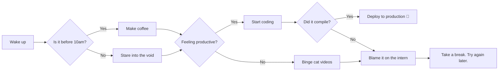

# Welcome to the Markdown Style Showcase

## It's Dangerous to Go Alone — Take This H2

This paragraph is here to test how your markdown text looks in a typical block of content.  
Now here's a manual line break above this one. Neat, huh?

## Emphasis Is Everything

*This text is just a little dramatic.*  
**This one is screaming.**  
***This one is screaming, dramatically.***

## Quote of the Day

> "Markdown: because sometimes, writing HTML feels like bringing a tank to a pillow fight."  
> — Anonymous Developer

## The Shopping List You Always Forget

- Milk  
- Bread  
  - Multigrain  
  - Whole wheat (the healthy guilt trip)  
- Chocolate (for emotional support)

## How to Adult, in Ordered Steps

1. Wake up (optional).  
2. Make coffee (mandatory).  
3. Pretend to be productive.

## Talking Nerdy

Inline code like `npm install` is perfect for terminal vibes.

### Code Block (JS Edition)

```js
function debugLife() {
  console.log("Why is this bug still here?");
}
debugLife();
```

## Check Out This Link Before It Expires (It Doesn't)

Download more Rosé Pine Themes [Here](https://rosepinetheme.com/themes/)

## Fancy Spreadsheet Vibes

| Task           | Status    |
|----------------|-----------|
| Write Markdown | ✅ Done    |
| Style Markdown | ⏳ Pending |

> You’ve Been Horizontally Ruled

---

## Escaping the Matrix

Sometimes you just want to show a `*` without *emphasizing* anything.

## Keyboard Shortcuts FTW

To screenshot like a pro: <kbd>Cmd</kbd> + <kbd>Shift</kbd> + <kbd>4</kbd>

## Pay Attention!

<mark>Seriously, this part is super important.</mark>

## Drawing Diagrams Like It's the 21st Century



## Code So Good, We Colored It

```python
def unleash_dragons():
    print("Here be dragons 🐉")

unleash_dragons()
```

---

_This markdown file was handcrafted with love, sarcasm, and a healthy respect for whitespace._

